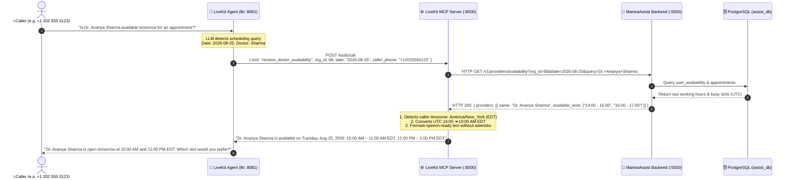

# Model Context Protocol (MCP) System Architecture

> **Architecture Style:** MCP Gateway & Microservice Routing  
> **Server Port:** `livekit-mcp` on port `:8000`  
> **Backend Integration:** HTTP REST Endpoint on `MantraAssist-backend` (`:5500`)  
> **Telephony Engine:** `lkt` Voice Agent on `:8081`  
> **Last Updated:** 2026-08-25

---

## 1. System Overview

The **LiveKit MCP Server** acts as the central intelligence and context middleware for MantraCare's voice telephony engine. 

Instead of embedding proprietary backend logic or hardcoded REST URLs inside the voice agent, the agent interacts with **MCP Tools**. When an availability query is made, `livekit-mcp` executes a high-speed HTTP request to the `MantraAssist-backend` REST API, converts the returned UTC doctor schedules into the caller's localized timezone, and returns conversational, speech-ready text to the LLM.

```
┌─────────────────────────────────────────────────────────────────────────────┐
│ 1. lkt (:8081) [VOICE TELEPHONY AGENT]                                      │
│    • Live Inbound / Outbound Phone Call                                     │
│    • STT (Deepgram) ➔ LLM (DeepSeek/GPT-4o) ➔ TTS (Sonic-3)                 │
│    • Calls MCP tool: `receive_doctor_availability`                          │
└──────────────────────────────────────┬──────────────────────────────────────┘
                                       │ 1. Executes MCP Tool (HTTP POST /tools/call)
                                       ▼
┌─────────────────────────────────────────────────────────────────────────────┐
│ 2. livekit-mcp (:8000) [THE MCP SERVER & GATEWAY]                           │
│    • Starlette ASGI + FastMCP Framework                                     │
│    • Timezone Resolver: Google phonenumbers (+1 ➔ EDT, +91 ➔ IST)           │
│    • Timezone Converter: UTC ranges (04:30) ➔ Local 12h slots (10:00 AM)    │
│    • Fallback: Direct PostgreSQL assist_db query if backend is unreachable  │
└──────────────────────────────────────┬──────────────────────────────────────┘
                                       │ 2. HTTP GET /v1/providers/availability
                                       ▼
┌─────────────────────────────────────────────────────────────────────────────┐
│ 3. MantraAssist-backend (:5500) [CORE BACKEND API]                          │
│    • Express.js / TypeScript REST Service                                   │
│    • Endpoint: `GET /v1/providers/availability`                         │
│    • Queries PostgreSQL `user_availability` and `appointments`              │
│    • Returns doctor list and open slots in standard UTC                     │
└─────────────────────────────────────────────────────────────────────────────┘
```

---

## 2. End-to-End Dynamic Call Flow



---

## 3. Key Advantages of This Architecture

1. **Clean Separation of Concerns**:
   - Backend developers build simple, robust REST endpoints (`GET /v1/providers/availability`) in Node.js.
   - LiveKit MCP handles timezone parsing, phone parsing, LLM context formatting, and protocol normalization.
   - The Voice Agent receives pre-formatted, speech-optimized text.

2. **International Timezone Intelligence**:
   - The backend stores and returns all times in pure **UTC**.
   - `livekit-mcp` automatically detects if the caller is in New York (`+1`), London (`+44`), Mumbai (`+91`), or Dubai (`+971`), converting the UTC times on the fly without any backend timezone logic.

3. **High Availability & Resiliency**:
   - If the backend REST service is restarting or experiencing latency, `livekit-mcp` has a built-in direct PostgreSQL query fallback to ensure live calls are never interrupted.

---

## 4. Related Guides
- [[Features/MCP Integration Guide for Backend.md|Backend Developer REST Integration Guide]]
- [[Features/Doctor Availability Tool.md|Voice Agent Doctor Availability Tool]]
- [[MCP Architecture.canvas|Interactive MCP Whiteboard Canvas]]
