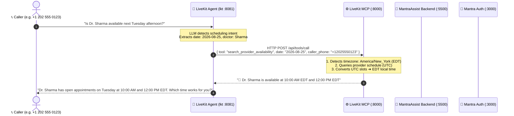
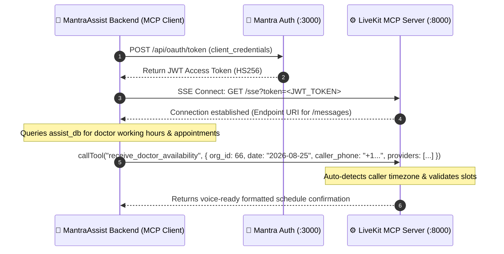

# Model Context Protocol (MCP) System Architecture

> **Protocol Version:** MCP 2.0 (Model Context Protocol)  
> **Transports:** SSE (Server-Sent Events) over HTTP / Streamable HTTP POST  
> **Target Services:** `mantra-auth` (:3000), `MantraAssist-backend` (:5500), `livekit-mcp` (:8000), `lkt` (:8081)  
> **Last Updated:** 2026-08-24

---

## 1. What is the Model Context Protocol (MCP)?

The **Model Context Protocol (MCP)** is an open industry standard (created by Anthropic) designed to connect AI applications and agents to external data sources, enterprise databases, and business tools in a secure, standardized way.

### Why MCP Instead of Traditional REST APIs?
Traditional AI applications require bespoke custom REST code, ad-hoc prompt engineering, and static API wrappers for every database or external tool. MCP replaces this with a structured **Client-Server Protocol**:

| Traditional REST Integration | Model Context Protocol (MCP) |
| :--- | :--- |
| Static, hardcoded endpoints requiring custom client code per API | **Dynamic Tool Discovery**: Agents automatically discover available tools, arguments, and types via JSON-RPC 2.0 schema negotiation. |
| Complex polling or fragmented websocket implementations | **Native Streaming Transports**: Built-in Server-Sent Events (SSE) and bidirectional messaging. |
| Inconsistent payload schemas and data serialization | **Strict JSON Schema Contracts**: Structured type validation and error handling for LLMs. |
| Tight coupling between backend endpoints and AI prompts | **Clean Separation of Concerns**: Backend services act as MCP clients, tools run in an isolated MCP server, and voice agents consume clean context. |

---

## 2. The 4-Tier MantraCare Architecture

Our telephony ecosystem consists of four specialized services collaborating via MCP:

```
┌─────────────────────────────────────────────────────────────────────────────┐
│ 1. mantra-auth (:3000)                                                      │
│    Next.js OAuth 2.1 Authorization Server                                   │
│    • DB: postgres_auth (:5441 / mantra_auth_dev)                            │
│    • Issues HS256 JWT Tokens for Clients & Services                         │
└──────────────────────────────────────┬──────────────────────────────────────┘
                                       │ Issues JWT Bearer Token
                                       ▼
┌─────────────────────────────────────────────────────────────────────────────┐
│ 2. MantraAssist-backend (:5500) [MCP CLIENT]                                │
│    Express.js / TypeScript Core Backend                                     │
│    • Computes doctor availability from PostgreSQL (assist_db)               │
│    • Connects via `@modelcontextprotocol/sdk` to livekit-mcp                │
│    • Calls tool `receive_doctor_availability` over SSE                      │
└──────────────────────────────────────┬──────────────────────────────────────┘
                                       │ Invokes MCP Tool (JSON-RPC over SSE)
                                       ▼
┌─────────────────────────────────────────────────────────────────────────────┐
│ 3. livekit-mcp (:8000) [THE MCP SERVER & MIDDLE-MAN]                        │
│    Starlette ASGI + MCP 2.0 SSE Transport                                   │
│    • Auth Middleware: Validates shared HS256 JWT                            │
│    • Timezone Engine: Auto-detects caller country from phone (+1, +44, +91) │
│    • Normalizer: Converts raw UTC working hours ➔ Caller's Local Time       │
│    • Endpoints: /sse, /messages, /health, /api/tools/call                   │
└──────────────────────────────────────┬──────────────────────────────────────┘
                                       │ Real-time Voice Context
                                       ▼
┌─────────────────────────────────────────────────────────────────────────────┐
│ 4. lkt (:8081) [VOICE TELEPHONY AGENT]                                      │
│    MantraCare LiveKit Voice Telephony Engine                                │
│    • STT (Deepgram) ➔ LLM (GPT-4o-Mini/DeepSeek) ➔ TTS (Sonic-3)           │
│    • Calls `check_doctor_availability` dynamically mid-conversation         │
│    • Speaks natural localized appointment slots to the caller               │
└─────────────────────────────────────────────────────────────────────────────┘
```

---

## 3. End-to-End Sequence Diagrams

### Flow A: In-Call Dynamic Doctor Availability Lookup (Mid-Call)

When a patient calls or receives an outbound call and asks for doctor availability mid-conversation:



---

### Flow B: Backend Push / Pre-Computed Availability (MCP Client Flow)

When `MantraAssist-backend` computes availability and communicates with `livekit-mcp` as an MCP Client:



---

## 4. MCP Security & Authentication Model

1. **OAuth 2.1 Confidential Clients**:
   - `MantraAssist-backend` is registered as a **Trusted Client** in `mantra-auth`.
   - Uses `client_id` and `client_secret` to obtain JWT access tokens.
2. **Shared JWT Validation (`livekit-mcp`)**:
   - `livekit-mcp` validates JWTs using the shared secret (`JWT_SECRET`).
   - Tokens can be provided via standard HTTP Header (`Authorization: Bearer <token>`) or Query Parameter (`?token=<token>`) for EventSource SSE compatibility.
3. **No Unauthenticated Execution**:
   - Public routes: `/health`, `/`
   - Protected routes: `/sse`, `/messages`, `/api/tools/call`

---

## 5. Tool Catalog

| Tool Name | Type | Description |
| :--- | :--- | :--- |
| **`receive_doctor_availability`** | Receiver Tool | Accepts calculated doctor schedules (array of providers with UTC slots) from `MantraAssist-backend`, auto-detects caller timezone, and formats voice-ready text. |
| **`search_provider_availability`** | Query Tool | Direct PostgreSQL query tool for `assist_db` evaluating RFC 5545 recurrence rules and working hours. |
| **`greet_user`** | Diagnostic Tool | Health check and latency testing tool. |

---

## 6. Related Documentation
- [[Features/MCP Integration Guide for Backend.md|Backend Developer Integration Guide]]
- [[Features/Doctor Availability Tool.md|Voice Agent Doctor Availability Tool]]
- [[Architecture/APIs.md|LiveKit API Reference]]
- [[Architecture/Security & Auth.md|Security & Authentication Architecture]]
